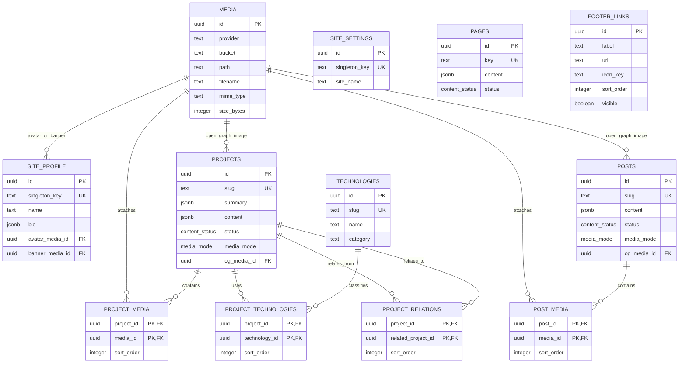

# R3 — Supabase PostgreSQL + Drizzle

## Status

The local R3 database foundation is implemented. Supabase project access and a
real PostgreSQL connection were not available in this execution environment, so
the migration has been generated and checked but not applied to a cloud database.

`R3_CLOUD_STATUS=BLOCKED_AUTH`

No connection URL, password, API key, or Supabase token is committed here.

## Selected versions

| Package | Version |
| --- | --- |
| `drizzle-orm` | `0.45.3` |
| `drizzle-kit` | `0.31.11` |
| `postgres` | `3.4.9` |
| Node.js policy | `>=24.0.0 <25` |
| pnpm | `11.1.0` |

## Connection strategy

The application has no browser-to-database path. Future server-side application
code will use `DATABASE_URL`, intended for Supavisor transaction mode on port
6543. The postgres.js client sets `prepare: false` and `max: 1`, which matches
transaction pooling and keeps the application-side connection budget small.

Drizzle Kit uses `DATABASE_MIGRATION_URL`, intended for the direct PostgreSQL
endpoint on port 5432. `pnpm db:migrate` refuses to start when that variable is
missing. No runtime connection is created during the current Next.js build
because no application page imports `src/db/client.ts`.

`src/db/client.ts` is server-only and lazily constructs a typed Drizzle client.
Development uses a `globalThis` cache to avoid a new postgres.js client on every
Next.js HMR evaluation. Production uses one module-level resource set.

## Schema ownership

All application tables live in the dedicated PostgreSQL schema `portfolio`,
created through the single Drizzle `portfolioSchema` object. Tables are not
created in `public`, and R3 does not use Supabase's Data API or JavaScript
client. Future public reads and CMS writes must remain behind server-side
application boundaries.

## Entity relationships



## Tables and constraints

- `site_profile` is a singleton by a fixed `singleton_key = 'default'` value,
  backed by a unique constraint and a check constraint. Profile media references
  use `ON DELETE SET NULL`.
- `site_settings` uses the same explicit singleton strategy. It contains only
  site-level metadata and default SEO values.
- `media` stores provider-neutral object identity (`provider`, optional
  `bucket`, and non-empty `path`) rather than temporary URLs. Size is
  non-negative; optional dimensions must be positive.
- `pages` uses a unique stable `key`, JSONB content, publication status, and a
  database check requiring `published_at` when status is `published`.
- `technologies` uses a unique non-empty slug and non-negative ordering. Its
  category is text rather than an enum so future CMS taxonomy changes do not
  require enum migrations.
- `projects` uses a unique slug, JSONB summary/content, optional dates and URLs,
  publication metadata, and optional OG media. A present end date cannot precede
  the start date.
- `posts` is the fresh successor to V1 feeds. It has no V1-specific `custom`
  field; presentation is represented by `media_mode`.
- `footer_links` stores a trusted `icon_key`, not raw SVG/HTML, with visible and
  ordering fields. This removes the old stored-markup/XSS shape.
- Join rows use composite primary keys. Project/post media and technology rows
  cascade with their content parent, while referenced media/technology rows use
  `RESTRICT` to prevent silent loss of content relationships.
- Project relations are directional, unique per pair, and reject self-links.
  Reverse rows are not created by a trigger.
- `project_media` and `post_media` intentionally do not enforce unique
  `sort_order`; this keeps reorder transactions simple while the future
  application layer can normalize positions.

All entity IDs are PostgreSQL-generated UUIDs. Mutable tables have UTC
`created_at` and `updated_at` timestamps with database defaults. R3 does not add
hidden timestamp triggers.

## Enums

- `portfolio.content_status`: `draft`, `published`, `archived`.
- `portfolio.media_mode`: `collage`, `slider`, `gallery`.

## Indexes

Unique constraints cover stable page keys, slugs, and singleton keys. The
initial migration also adds:

- `projects(status, published_at)` for future public project listing queries;
- `posts(status, published_at)` for future public post listing queries;
- `footer_links(sort_order)` for ordered footer output.

Join-table composite primary keys cover their parent lookup prefix. No partial
publication indexes were added yet because public query paths and table sizes
are not known.

## Database security baseline

The migration explicitly:

1. revokes schema usage and table/sequence privileges from `anon` and
   `authenticated`;
2. revokes future default table, sequence, and function privileges from those
   browser roles within `portfolio`;
3. enables RLS on every R3 application table;
4. creates no browser-facing policies.

This is defense in depth. The primary boundary remains that V2 does not use
Supabase Data API for application data. The exact grants and RLS state remain
unverified until the migration runs against the approved Supabase project.

Supabase-managed schemas (`auth`, `storage`, `realtime`, `extensions`,
`graphql`, and `vault`) are not modified, and R3 creates no foreign key to
`auth.users`.

## Migration workflow

```text
pnpm db:generate   # create checked-in SQL from TypeScript schema
pnpm db:check      # validate migration journal/checks
pnpm db:migrate    # requires DATABASE_MIGRATION_URL
pnpm db:ping       # requires DATABASE_URL; SELECT 1 only
pnpm db:verify     # requires DATABASE_MIGRATION_URL; read-only verification
pnpm db:studio     # optional local inspection tool
```

`drizzle-kit push`, destructive reset/drop scripts, and seed/content scripts
are intentionally absent. The initial checked-in migration is
`drizzle/0000_chemical_squadron_sinister.sql`; its final statements are reviewed
custom SQL for grants and RLS that are not represented by the Drizzle schema
DSL.

## Known limitations

- No authenticated Supabase CLI/API session or database URL was available, so
  cloud project provisioning, migration application, ping, RLS verification,
  and privilege verification remain blocked.
- No portfolio content is seeded.
- No repositories, application services, auth tables, storage buckets, CMS
  tables, contact tables, or rich-content editor schema exist yet.
- JSONB fields intentionally use conservative `unknown` typing until R6 defines
  the rich-content representation.
