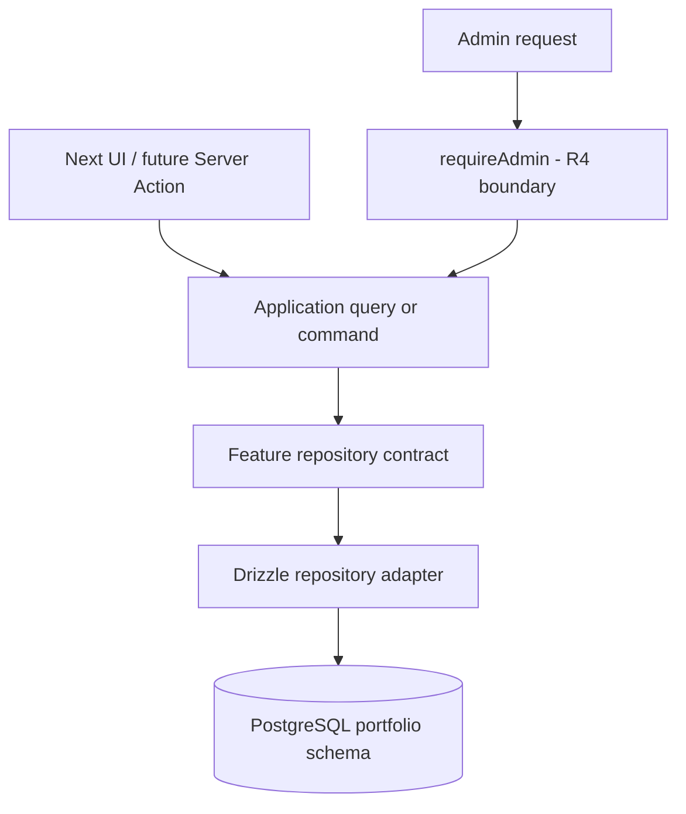

# R5 — Application / Domain / Data Boundaries

## Status

R5 is the application/data-boundary phase. It introduces no database schema
change and no public content rendering. The implementation is deliberately
small: feature contracts, pure mapping, Drizzle adapters, a transaction
boundary, and verification against the existing Supabase development database.

## Architecture



The intended dependency direction is:

```text
infrastructure → application → domain
```

Domain and application code do not import React, Next.js, Supabase, Drizzle,
or postgres.js. Drizzle is confined to `src/infrastructure/drizzle/` and the
existing `src/db/` schema/client. The R4 auth exception remains isolated in
`src/lib/auth/admin.ts`; content repositories do not authorize users.

## Structure

```text
src/application/
├── errors.ts
├── pagination.ts
├── repositories.ts
├── transaction.ts
└── *.test.ts

src/features/
├── profile/
├── settings/
├── pages/
├── projects/
├── posts/
├── technologies/
├── media/
├── footer/
└── shared/

src/infrastructure/drizzle/
├── create-repositories.ts
├── transaction-manager.ts
├── executor.ts
├── errors.ts
└── *-repository.ts
```

No generic `BaseRepository`, service locator, DI container, CQRS bus, or DDD
class hierarchy was added.

## Domain and DTO policy

Feature domain types use `Date` and provider-neutral concepts. DTOs use ISO
8601 timestamps and intentionally omit database-only details. Nullable database
values remain `null`; fields absent from a narrower DTO are omitted by its
shape. JSONB content is `OpaqueContent = unknown` until R6 defines the
canonical rich-content model. R5 performs no Lexical/Slate parsing.

Media public DTOs expose metadata only (`id`, filename, MIME, size, dimensions,
alt, caption). Provider, bucket, and storage path are retained in the domain
model for server-side metadata work but are not automatically public.

## Application contracts

Public query entrypoints exist for profile, settings, published pages, published
projects, published posts, technologies, visible footer links, and media
metadata. Admin read contracts exist for paginated page/project/post/footer
reads where the future CMS needs draft-aware data. R5 does not connect these
queries to UI routes.

The only write proofs are validated `saveSiteSettings()` and
`upsertTechnology()`. They accept unknown input, validate with Zod, run through
the transaction boundary, and return DTOs rather than Drizzle rows.

## Publication and ordering rules

- Public pages require `status = published` and `published_at <= now`.
- Public projects and posts apply the same rule.
- Published lists sort by `published_at DESC, id DESC`.
- Admin project/post lists sort by `updated_at DESC, id DESC`.
- Visible footer reads enforce `visible = true` inside the repository.
- Technologies sort by `sort_order ASC, name ASC, id ASC`.
- Admin status filters accept only the domain `ContentStatus` union.

## Pagination

`normalizePageRequest()` is the single application pagination boundary. It
defaults to 20 items, clamps the limit to 100, and prevents negative offsets or
non-positive limits. Repositories receive normalized offset/limit semantics;
URL query-string parsing remains a future route concern.

## Relation loading and N+1 policy

Project and post adapters load standard relations in bounded batches. Project
technology, project media, related-project, post-media, and OG-media lookups
are grouped by the selected parent IDs rather than queried once per row.
List queries select summary columns and omit opaque full project/post content;
detail queries load content. Related projects are bounded summaries, not
recursive graphs. R5 does not invent media URLs.

## Transactions

`TransactionManager` accepts an operation over `RepositorySet`. The concrete
adapter uses one Drizzle transaction and composes feature repositories against
the transaction executor. The application layer sees neither Drizzle's
transaction type nor a raw SQL client.

`createRepositories(dbExecutor)` is explicit composition, not a service
locator. It is usable with either the normal database executor or a transaction
executor.

## Errors

`ApplicationError`, `NotFoundError`, `ConflictError`, and `ValidationError`
provide a small application vocabulary. Known PostgreSQL unique violations are
translated to `ConflictError`; raw SQL and driver objects do not cross the
application contract intentionally. Repositories use nullable reads for
missing records, allowing future route/application adapters to choose the
appropriate HTTP behavior.

## Testing

Application tests use feature-specific fakes and cover pagination, mapping,
validation, command orchestration, and import restrictions. The explicit
`pnpm test:db` command runs live Supabase repository tests with
`__r5_test__`-prefixed fixtures, transaction rollback/commit checks, relation
mapping, visibility/publication filtering, and cleanup. Ordinary `pnpm test`
does not require database credentials.

## Feature matrix

| Feature | Domain | DTO | Repository | Drizzle adapter | Public read | Admin read | Write proof |
| --- | --- | --- | --- | --- | --- | --- | --- |
| Profile | yes | public | singleton get/save | yes | yes | contract only | no |
| Settings | yes | public | singleton get/save | yes | yes | contract only | save |
| Pages | yes | public | key/published/admin list | yes | published key | list | no |
| Projects | yes | public/admin | published/admin/detail | yes | list/detail | list/detail | no |
| Posts | yes | public/admin | published/admin/detail | yes | list/detail | list/detail | no |
| Technologies | yes | public | ordered/slug/IDs/upsert | yes | read contract | ordered | upsert |
| Media | yes | provider-neutral | ID/IDs | yes | metadata read | metadata read | no |
| Footer | yes | public | visible/admin list | yes | visible list | list | no |

## Hard boundaries carried forward

R5 does not implement Rich Content, Supabase Storage, upload/download/signed
URLs, media processing, CMS CRUD, Server Actions for content, revisions, audit
logs, caching/revalidation, contact behavior, repositories in the admin UI, or
public Portfolio data rendering. R6 owns rich content and media infrastructure;
R7 owns the full CMS; R8 owns public page consumption.
